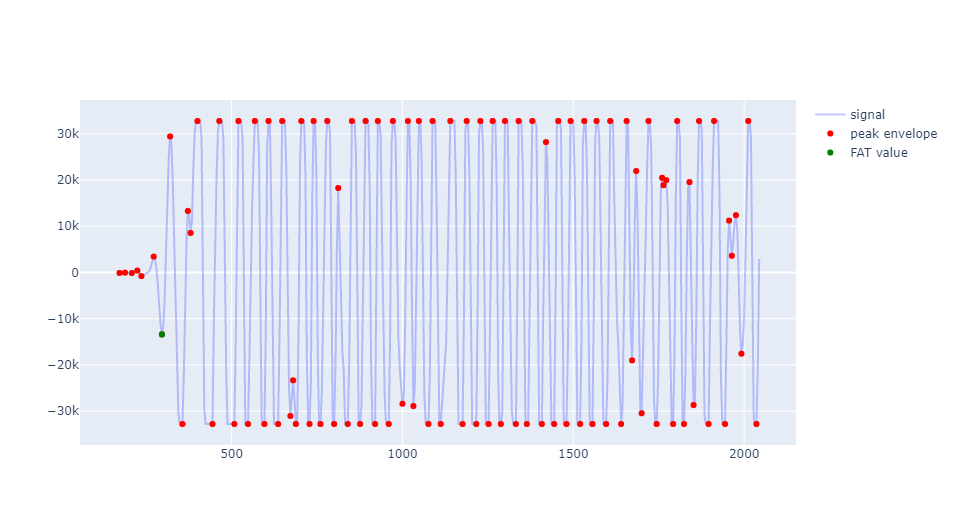
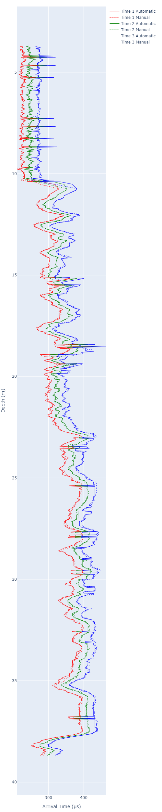

# Automated interpretation of sonic log readings

Automated interpretation of sonic logging readings of borehole at every depth.

## FAT (First time arrival) of sonic logging

**Objective:** To find the FAT (First Time arrival) peak of the sonic logging reading of borehole no. B3 in Malmoe in Sweden.

The borehole is about 39m deep, and sonic data are recorded for every depth step of 0.02m. The probe has 1 emitter and 3 receivers. The distances between the receivers and the emitter is 600mm, 800mm and 1000mm, and output from this tool is an SG2 file for each of the 3 receivers.

The length of the trace for each depth is 2044 µs in this case, and signed integer values for the measured amplitude is recorded for each 4 µs.

Example of sonic logging in borehole:

**References:**

[Indirect determination of shear wave velocity in slow formations using fullwave sonic logging technique](https://www.sciencedirect.com/science/article/pii/S1674775520301360#mmc2) as published in ScienceDirect Journal.

## Results

How the algorithm identifies the FAT:

The algorithm is in [jupyter notebook](FAT_algorithm-v2.ipynb)

## FAT for all the layer of a borehole and evaluation with manual interpretation: 

For more information on this please contact [Gert Andersen](GA@ramboll.dk)

